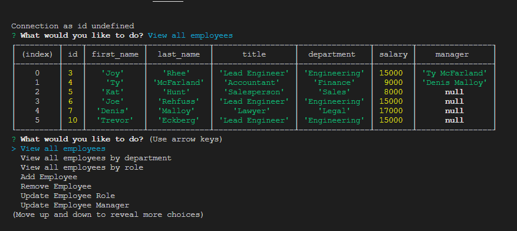

# Employee Tracker

## Table of Contents
    
1. [Description](##description)
2. [Installation Instructions](##installation-instructions)
3. [Usage Information](##usage-information)
4. [Contribution Guidelines](##contribution-guidelines)
5. [Test Instructions](##test-instructions)
6. [Questions](##questions)
7. [License](##license)
8. [Screenshot](##screenshot)
    
    
## Description
The goal of this project was to create a terminal based program to track employees using inquirer and mysql.
    
## Installation Instructions
For full functionality of this program it is required to install all npm dependencies contained in the package.json, including inquirer and mysql. Once installed navigate to the containing folder in your terminal and run "npm start".
    
## Usage Information
This program relies on data input from the user, a seed.sql file has been included to provide a starter database that can be created using mySQL workbench. There are a variety of options to select, including add new employee, remove employee, view current employees, update role, and much more. Navigation is controlled by the up and down arrow keys.
    
## Contribution Guidelines
This project is not currently accepting community contributions.
    
## Test Instructions
There are currently no test suites for this application. If you find a bug please send a detailed message to the developer, contact information can be found in the Questions section.
    
## Questions
If you have further questions about the functionality of this application or need clarification regarding certain areas the creator can be contacted at: 
Email: trevor.eckberg@gmail.com  
Github: https://github.com/trev-eck/
    
## License
This application was developed under the MIT License

## Screenshot
The application repository can be found at: https://github.com/trev-eck/employee-tracker

A video demonstrating the application functionality can be found at: https://drive.google.com/file/d/11IqCkhZQ-p7thnaCaNGndNN-6JEuki08/view

This readme was generated using the ReadME Generator : https://github.com/trev-eck/readme-generator
